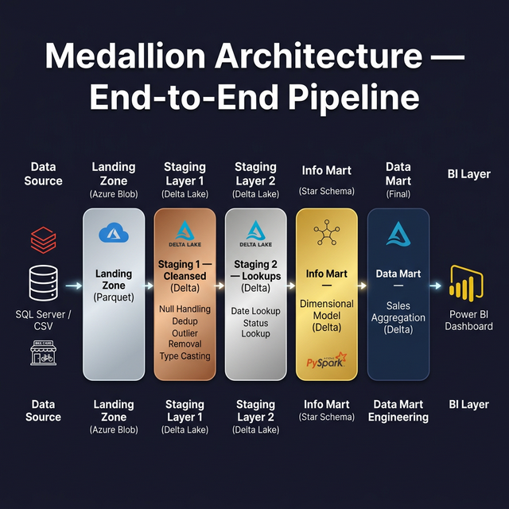
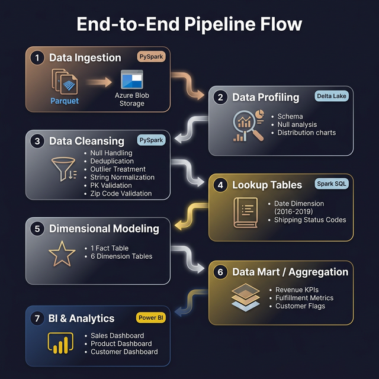
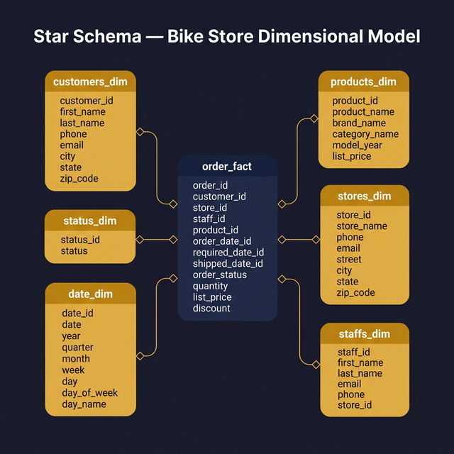
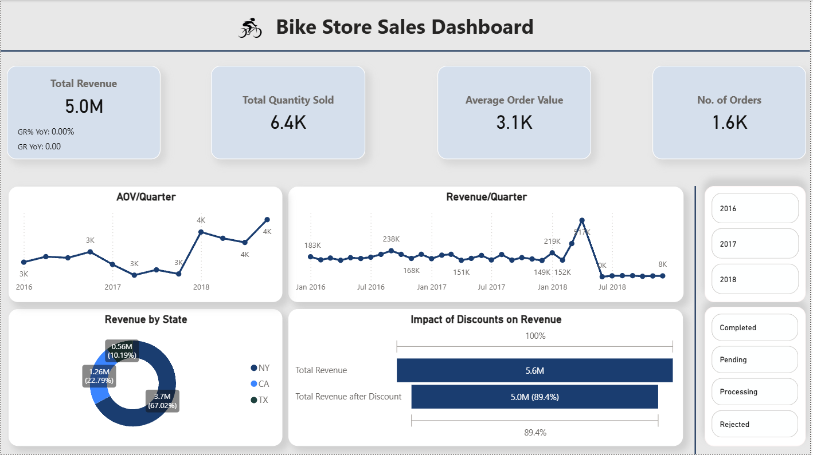
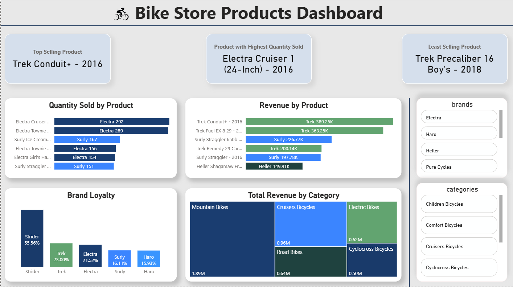
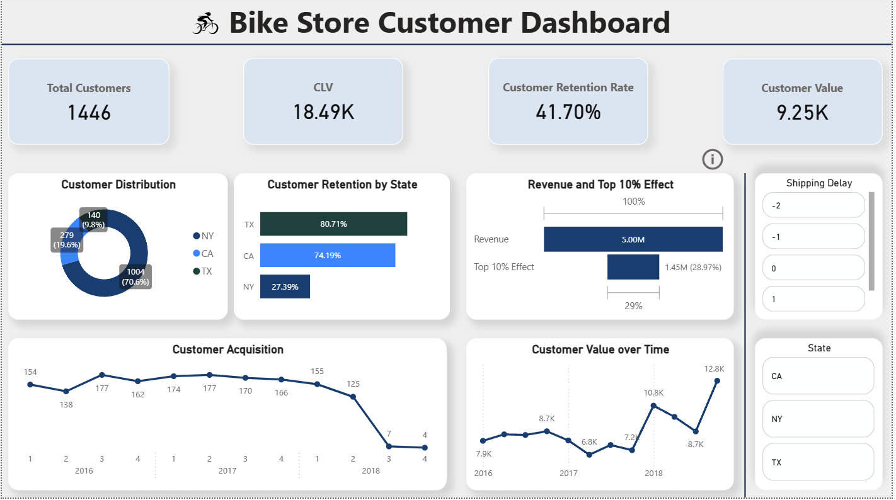

<p align="center">
  
</p>

<h1 align="center">Bike Store Sales — End-to-End Data Engineering Pipeline</h1>

<p align="center">
  
  
  
  
  
</p>

<p align="center">
A production-grade <strong>Medallion Architecture</strong> ETL pipeline built on <strong>Azure Databricks</strong> &amp; <strong>PySpark</strong>.<br/>
Ingests raw bike-store transactional data, cleanses and transforms it through multiple staging layers,<br/>
models it into a <strong>Star Schema</strong>, and serves a flattened <strong>Sales Data Mart</strong> to a Power BI dashboard.
</p>

---

## Table of Contents

- [Architecture Overview](#-architecture-overview)
- [Pipeline Flow](#-pipeline-flow)
- [Star Schema](#-star-schema)
- [Power BI Dashboard](#-power-bi-dashboard)
- [Tech Stack](#-tech-stack)
- [Project Structure](#-project-structure)
- [Pipeline Execution Order](#-pipeline-execution-order)
- [Setup & Configuration](#-setup--configuration)
- [Key Features](#-key-features)
- [License](#-license)

---

## Architecture Overview

The pipeline follows the **Medallion Architecture** pattern (Bronze → Silver → Gold) implemented across Azure Data Lake Storage with Delta Lake format:

<p align="center">
  
</p>

| Layer         | Storage Container     | Format  | Purpose                                   |
| ------------- | --------------------- | ------- | ----------------------------------------- |
| **Landing**   | `dlbikestorelanding`  | Parquet | Raw ingested data from source systems     |
| **Staging 1** | `dlbikestorestage1`   | Delta   | Cleansed, deduplicated, type-cast data    |
| **Staging 2** | `dlbikestorestage2`   | Delta   | Lookup / reference tables (Date, Status)  |
| **Info Mart** | `dlbikestoreinfomart` | Delta   | Star schema — 1 fact + 6 dimension tables |
| **Data Mart** | `waheeddatamart`      | Delta   | Flattened, KPI-enriched table for BI      |

---

## Pipeline Flow

<p align="center">
  
</p>

Each notebook corresponds to a discrete pipeline stage:

1. **Data Ingestion** — Metadata-driven loading of Parquet files from the Landing Zone
2. **Data Profiling** — Schema exploration, statistical summaries, null analysis, histograms
3. **Data Cleansing** — Null handling, deduplication, outlier treatment (IQR/Z-Score), string normalisation, zip-code validation, primary-key integrity checks
4. **Lookup Tables** — Generates a date dimension (2016–2019) and shipping status reference
5. **Dimensional Modeling** — Builds the star schema: `order_fact` + 6 dimension tables
6. **Catalog Registration** — Registers all Delta tables in the Hive/Unity Catalog as `waheed_db`
7. **Data Mart Creation** — Final SQL join of all dimensions with calculated KPIs
8. **BI & Analytics** — Power BI dashboards consuming the data mart

---

## Star Schema

<p align="center">
  
</p>

| Table           | Type      | Key Columns                                                                                           |
| --------------- | --------- | ----------------------------------------------------------------------------------------------------- |
| `order_fact`    | Fact      | `order_id`, `customer_id`, `store_id`, `staff_id`, `product_id`, `quantity`, `list_price`, `discount` |
| `customers_dim` | Dimension | `customer_id`, name, contact, address                                                                 |
| `products_dim`  | Dimension | `product_id`, `brand_name`, `category_name`, `model_year`, `list_price`                               |
| `stores_dim`    | Dimension | `store_id`, `store_name`, contact, address                                                            |
| `staffs_dim`    | Dimension | `staff_id`, name, contact                                                                             |
| `date_dim`      | Dimension | `date_id`, `date`, `year`, `quarter`, `month`, `week`, `day`, `day_name`                              |
| `status_dim`    | Dimension | `status_id`, `status` (Pending / Processing / Rejected / Completed)                                   |

---

## Power BI Dashboard

The data mart feeds three interactive Power BI dashboards:

### Sales Dashboard

> KPIs: Total Revenue · Total Quantity Sold · Average Order Value · Number of Orders  
> Charts: AOV/Quarter · Revenue/Quarter · Revenue by State · Impact of Discounts on Revenue

<p align="center">
  
</p>

### Products Dashboard

> KPIs: Top Selling Product · Highest Quantity Product · Least Selling Product  
> Charts: Quantity Sold by Product · Revenue by Product · Brand Loyalty · Revenue by Category

<p align="center">
  
</p>

### Customer Dashboard

> KPIs: Total Customers · CLV · Customer Retention Rate · Customer Value  
> Charts: Customer Distribution · Retention by State · Customer Acquisition · Customer Value over Time

<p align="center">
  
</p>

---

## Tech Stack

| Category              | Technology                                          |
| --------------------- | --------------------------------------------------- |
| **Compute**           | Azure Databricks (PySpark)                          |
| **Storage**           | Azure Data Lake Storage Gen2 (Blob)                 |
| **Data Format**       | Delta Lake, Apache Parquet                          |
| **Language**          | Python 3.10+, Spark SQL                             |
| **Libraries**         | PySpark, pandas, pgeocode, scipy, matplotlib, numpy |
| **BI Tool**           | Microsoft Power BI                                  |
| **Secret Management** | Databricks Secret Scopes (Azure Key Vault backed)   |

---

## Project Structure

```
bike-store-etl-pipeline/
├── README.md
├── .gitignore
├── requirements.txt
├── Waheed_Power_BI.pbix          # Power BI report file
│
├── Use_Case/                     # Databricks notebooks
│   ├── config.py                 # Centralised config & secrets
│   ├── utils.py                  # Reusable ETL utility functions
│   ├── data_profiling_waheed.py  # Step 1: Data profiling
│   ├── data_cleansing_waheed.py  # Step 2: Data cleansing
│   ├── lookup_tables_waheed.py   # Step 3: Lookup table creation
│   ├── catalog_creation_waheed.py# Step 4: Hive catalog registration
│   ├── datamart_creation_waheed.py # Step 5: Sales data mart
│   │
│   └── info_mart/               # Dimensional model notebooks
│       ├── customer_dim.py
│       ├── date_dim.py
│       ├── order_fact.py
│       ├── products_dim.py
│       ├── staff_dim.py
│       ├── status_dim.py
│       └── store_dim.py
│
└── assets/                       # Visual assets for README
    ├── architecture_diagram.png
    ├── star_schema.png
    ├── pipeline_flow.png
    └── dashboard/
        ├── sales_dashboard.png
        ├── products_dashboard.png
        └── customer_dashboard.png
```

---

## Pipeline Execution Order

Run the notebooks in this exact sequence on your Databricks workspace:

```
1.  config.py                        # Loaded automatically by %run
2.  utils.py                         # Loaded automatically by %run
3.  data_profiling_waheed.py         # Explore & profile raw data
4.  data_cleansing_waheed.py         # Cleanse → write to Staging 1
5.  lookup_tables_waheed.py          # Date & status lookups → Staging 2
6.  info_mart/store_dim.py           # ┐
7.  info_mart/customer_dim.py        # │
8.  info_mart/staff_dim.py           # │ Build dimensional
9.  info_mart/status_dim.py          # │ model (Info Mart)
10. info_mart/date_dim.py            # │
11. info_mart/products_dim.py        # │
12. info_mart/order_fact.py          # ┘
13. catalog_creation_waheed.py       # Register tables in Hive catalog
14. datamart_creation_waheed.py      # Build final sales data mart
```

---

## Setup & Configuration

### Prerequisites

- Azure Databricks workspace with Runtime 13+
- Azure Data Lake Storage Gen2 account
- Databricks Secret Scope (`bikes-scope`) backed by Azure Key Vault
- Power BI Desktop (for dashboard)

### 1. Clone the Repository

```bash
git clone https://github.com/<your-username>/bike-store-etl-pipeline.git
```

### 2. Configure Secrets

Ensure your Databricks Secret Scope has the storage account key:

```bash
databricks secrets put --scope bikes-scope --key account-key
```

### 3. Import Notebooks

Import the `Use_Case/` folder into your Databricks workspace.

### 4. Run the Pipeline

Execute the notebooks in the [execution order](#-pipeline-execution-order) above.

### 5. Connect Power BI

Open `Waheed_Power_BI.pbix` and point it at the `waheed_db.sales_datamart_waheed` table.

---

## Key Features

| Feature                 | Description                                                                                      |
| ----------------------- | ------------------------------------------------------------------------------------------------ |
| **Metadata-Driven**     | Column types, nullability, uniqueness, and PK flags are all controlled by a central metadata CSV |
| **Outlier Detection**   | Supports both IQR and Z-Score methods with remove or cap strategies                              |
| **Zip Code Validation** | Uses `pgeocode` to validate US postal codes against a geographic database                        |
| **Idempotent Writes**   | All Delta writes use `overwrite` mode with `overwriteSchema` for safe re-runs                    |
| **Calculated KPIs**     | Revenue metrics, fulfillment flags, delivery delays, frequent customer flags                     |
| **Secret Management**   | Zero hardcoded credentials — all keys via Databricks Secret Scopes                               |

---

## License

This project is open-source and available under the [MIT License](LICENSE).

---

<p align="center">
  <strong>Built with ❤️ using Azure Databricks, PySpark & Delta Lake</strong>
</p>
